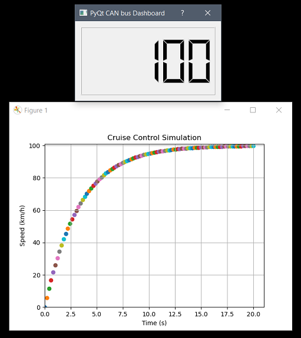

# industrial-networks/can
## About

A PyQt interface mimicking a car's dashboard displaying speed during its acceleration (0-100km/h) through CAN bus.

The simulation is based on a very simplified model of cruise control : PI controller, constant reference and no disturbances.

The dashboard must be launched before launching the simulation.

When the simulation starts, it broadcasts one recessive bit with an arbitration ID of 200. Then it broadcasts speed value each 100ms with an arbitration ID of 100.

This application has been tested using Kvaser Drivers for Windows. 

## Prerequisites

```
pip install python-can python-control numpy matplotlib pyqt5
```

## Screenshot



## Acknowledgments

- [Building a canbus app](https://www.moderndaymods.com/2020/01/26/building-a-canbus-app-part1/)
- [uCANWebApplication](https://github.com/CanEthernetConverter/uCANWebApplication)
- [Cruise Control: PID Controller Design](http://ctms.engin.umich.edu/CTMS/index.php?example=CruiseControl&section=ControlPID)
