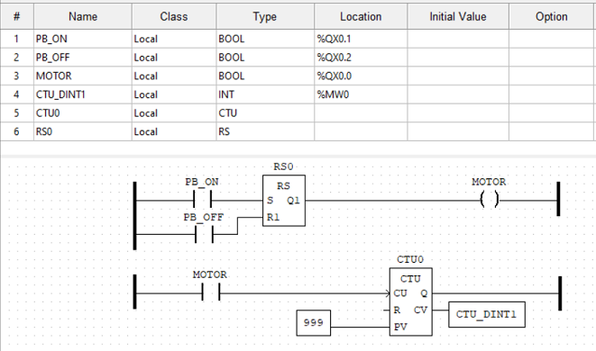

# industrial-networks/modbus
## About

A PyQt interface mimicking an HMI communication with a PLC via the Modbus protocol.

The ladder program is a basic start/stop for a motor with an additional counter for the number of cycles.

The ladder logic is simulated on OpenPLC's soft-plc.

## Prerequisites

```
pip install pymodbus pyqt5
```


## Screenshot


## Ladder logic program



## Acknowledgments

- [Hello World for OpenPLC and Modbus on Windows SoftPLC](https://www.ficksworkshop.com/blog/openplc-helloworld)
- [Synchronous Client Example](https://pymodbus.readthedocs.io/en/latest/source/example/synchronous_client.html)

