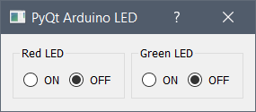
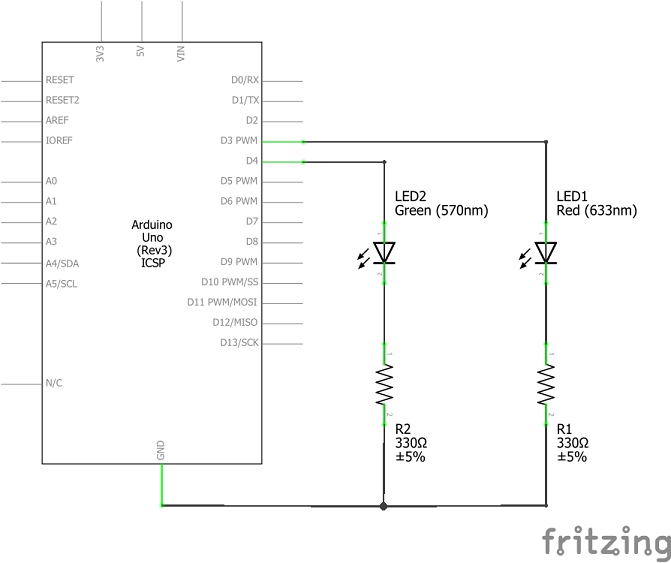

# industrial-networks/serial
## About

A simple PyQt interface to turn on/off two LED connected to an Arduino board.

## Prerequisites

```
pip install pyserial pyqt5
```

## Screenshot



## Schematic


## Acknowledgments

- [Qt-Temperature-Sensor](https://github.com/vannevar-morgan/Qt-Temperature-Sensor)
- [ArduinoPySerial_LearningSeries](https://github.com/WaveShapePlay/ArduinoPySerial_LearningSeries)

