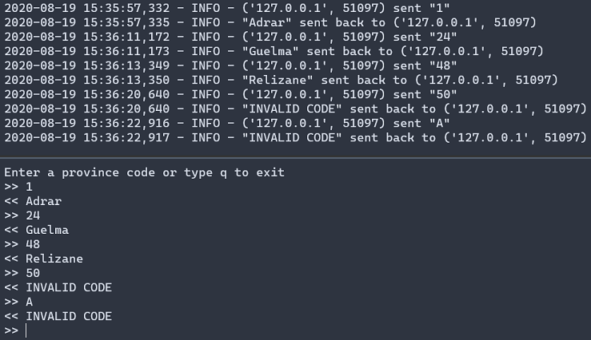

# industrial-networks/tcp
## About

Two simple Python scripts to simulate TCP/IP communication between a client and a server.

The server expect from the client a numerical code (1-48) and returns the corresponding province's name.

## Screenshot

## Acknowledgments

- [TCP/IP Client and Server](https://pymotw.com/3/socket/tcp.html)
- [TcpCommunication](https://wiki.python.org/moin/TcpCommunication)